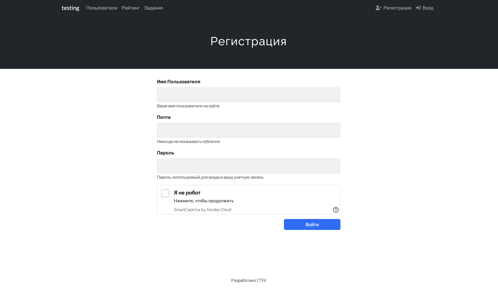

# ctfd-yandex-captcha

Plugin that adds [Yandex SmartCaptcha](https://yandex.cloud/en/docs/smartcaptcha/quickstart) to the registration form of CTFd.

## How to use?

1. Create and configure captcha in Yandex Cloud console (you can use [this guide](https://yandex.cloud/en/docs/smartcaptcha/quickstart#creat-captcha) to do so).
2. Add captcha keys to `YSC_CLIENT_KEY` and `YSC_SERVER_KEY` environment variables of `ctfd` container.
3. Copy this repository to CTFd plugins directory, which is located at `CTFd/plugins`.

That's all!

## Contributing

If you have any ideas for improvements or bugfixes to this plugin, feel free to open a pull request. You can also open an issue to discuss your ideas or suggest improvements.
